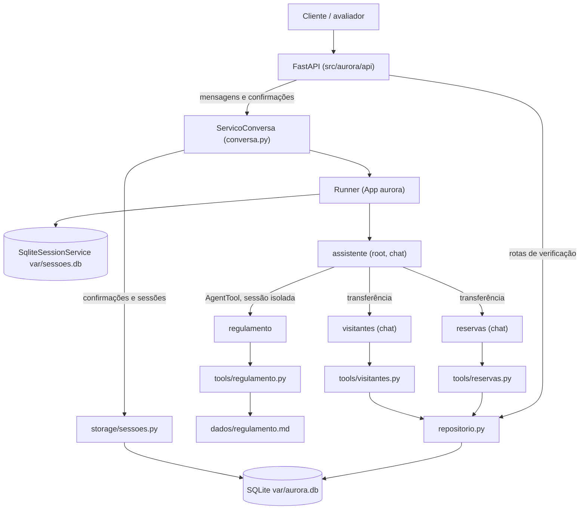

# Residencial Aurora — Assistente Virtual

Assistente virtual do Residencial Aurora: o morador conversa em linguagem natural para reservar áreas comuns, autorizar visitantes e tirar dúvidas sobre o regulamento. É uma API em Python 3.12 (gerenciada com uv) feita com `google-adk==2.11.0` e FastAPI, com persistência em SQLite.

## Arquitetura

O `assistente` recebe toda mensagem e decide quem responde. Reservas e visitantes são atendidos por especialistas que ficam com a conversa até devolvê-la; o regulamento é consultado por um especialista isolado. Todo o domínio (apartamentos, áreas, reservas, visitantes, pendências) e as sessões do ADK ficam em SQLite, em `var/`.

| Agente | Responsabilidade | Como é acionado | Por quê |
|---|---|---|---|
| `assistente` | Raiz: entende o pedido, delega, responde saudações e recusa assunto fora de escopo | Recebe todas as mensagens (`root_agent` do `App` `aurora`, modo `chat`) | Um único roteador deixa claro quem responde e mantém a conversa em uma só sessão |
| `reservas` | Disponibilidade, reserva e cancelamento de áreas comuns | Transferência (`sub_agents` do `assistente`, modo `chat`) | Reservar pode exigir confirmação do morador, e só o modo `chat` suporta pedir confirmação dentro do especialista; ele devolve o controle ao principal quando o assunto muda |
| `visitantes` | Autorizar e listar visitantes do apartamento | Transferência (`sub_agents` do `assistente`, modo `chat`) | Autorizar visitante sempre exige confirmação, pelo mesmo motivo de `reservas` |
| `regulamento` | Responde dúvidas sobre regras, horários e penalidades lendo o capítulo certo | `AgentTool` na lista de `tools` do `assistente` | Roda em sessão isolada: o texto dos capítulos não entra nos eventos da conversa principal |



**Fluxo de confirmação.** Quando uma tool exige confirmação (taxa maior que zero ou autorização de visitante), ela pede a confirmação ao ADK e devolve `pending`, sem gravar nada. No fim do turno o serviço de conversa registra a pendência no SQLite e a resposta da mensagem traz o `id` em `confirmacoes_pendentes`. A ação só executa quando a rota de confirmações recebe esse `id`: ela cria o `function_response` e o Runner retoma o agente que pediu, que reexecuta a tool original com a decisão do morador.

### Decisões registradas

- A restauração (`uv run aurora-restore`) recarrega apartamentos, áreas, reservas e visitantes e **não** apaga sessões nem histórico.
- As sessões do ADK ficam em `var/sessoes.db` e o domínio em `var/aurora.db`, dois arquivos SQLite.
- `POST /sessoes` com apartamento fora de `dados/apartamentos.json` responde `422 "Apartamento inexistente."`; as rotas de verificação de um apartamento sem registros respondem `200 []`.
- Uma nova mensagem com confirmação pendente é aceita, mas nada executa sem a rota de confirmações. Uma pendência expira (`409` ao responder) quando o agente que a pediu deixa de ser o agente ativo da sessão, porque a retomada não chegaria a ele.
- Códigos de reserva são `RSV-` mais 6 caracteres `[A-Z0-9]`.
- Os modelos padrão são `gemini-3.6-flash` (configuráveis por `AURORA_MODEL_PRINCIPAL` e `AURORA_MODEL_ESPECIALISTA`) e o `google-adk==2.11.0` é fixado.

## Garantias

Cada garantia aponta o arquivo e o símbolo onde é aplicada (sem número de linha, para não envelhecer) e o teste que a prova. `tests/test_readme.py` confere que cada arquivo, símbolo e teste citado existe.

### Garantia 1 — cobrança ou acesso só com confirmação

| Arquivo | Trecho | O que faz | Verificação |
|---|---|---|---|
| [reservas.py](src/aurora/tools/reservas.py) | `reservar_area` | Lê a área do banco; `taxa > 0` chama `request_confirmation` com `acao` e `detalhes` e devolve `pending` sem gravar; só grava com `tool_confirmation.confirmed is True`; quadra (taxa 0) grava direto | `test_reservas_tools.py`, `test_obter_area_taxa_vem_do_banco` |
| [visitantes.py](src/aurora/tools/visitantes.py) | `autorizar_visitante` | Sempre pede confirmação; grava só após a aprovação | `test_texto_de_confirmacao_nao_resolve`, `test_aprovacao_reexecuta_e_grava_uma_vez`, `test_negacao_reexecuta_sem_gravar` |
| [conversa.py](src/aurora/conversa.py) | `enviar_mensagem` | A rota de mensagens monta só `Part(text=...)`; texto nunca vira `function_response` | `test_texto_de_confirmacao_nao_resolve` |
| [conversa.py](src/aurora/conversa.py) | `conteudo_confirmacao` | Único lugar que cria o `FunctionResponse` `adk_request_confirmation`, usado só por `responder_confirmacao` | `test_aprovar_apos_reinicio_executa_uma_vez` |
| [sessoes.py](src/aurora/storage/sessoes.py) | `responder_pendencia` | `UPDATE ... WHERE id=? AND session_id=? AND status='pendente'`: só a primeira resposta afeta uma linha | `test_reenvio_mesmo_id_409_sem_efeito`, `test_id_inexistente_409`, `test_id_de_outra_sessao_409`, `test_responder_pendencia_concorrente_threads` |
| [confirmacoes.py](src/aurora/api/confirmacoes.py) | `responder_confirmacao` | `ConfirmacaoNaoPendente` vira `409` e nada executa | `test_409_funciona_sem_chave` |
| [conversa.py](src/aurora/conversa.py) | `_checar_retomada` | Confere nos eventos da retomada o `function_response` da tool original (a resposta chegou ao agente que pediu) | `test_aprovar_apos_reinicio_executa_uma_vez` |

**Por que não depende do modelo:** quem decide pedir confirmação é a tool, a partir da taxa gravada no banco ou da natureza da ação; o modelo não tem argumento para pular isso. A aprovação só existe como `function_response` criado pela rota de confirmações, e a rota só aceita uma pendência registrada naquela sessão, uma única vez.

### Garantia 2 — cada sessão pertence a um apartamento

| Arquivo | Trecho | O que faz | Verificação |
|---|---|---|---|
| [conversa.py](src/aurora/conversa.py) | `criar_sessao` | Única escrita da chave `apartamento` no state, na criação da sessão (`POST /sessoes`) | `test_criar_sessao_grava_apartamento_no_state`, `test_unica_escrita_da_chave_apartamento` |
| [sessao.py](src/aurora/tools/sessao.py) | `apartamento_da_sessao` | Única leitura do apartamento pelas tools; sem apartamento no state é erro de infraestrutura | `test_apartamento_da_sessao_le_state`, `test_tools_usam_apartamento_do_state` |
| [repositorio.py](src/aurora/storage/repositorio.py) | `listar_reservas_ativas`, `cancelar_reserva`, `listar_visitantes` | Filtram por `apartamento = ?` no SQL | `test_listar_minhas_reservas_so_do_apartamento_da_sessao`, `test_cancelar_reserva_alheia_mesma_mensagem_de_inexistente` |
| [repositorio.py](src/aurora/storage/repositorio.py) | `area_ocupada` | Devolve só booleano: a agenda da área nunca expõe dono nem código | `test_area_ocupada_so_booleano`, `test_reservar_data_ocupada_por_outro_sem_vazar` |
| [assistente.py](src/aurora/agents/assistente.py) | `criar_assistente` | Nenhuma tool registrada declara parâmetro de apartamento | `test_nenhuma_tool_aceita_apartamento` |

**Por que não depende do modelo:** nenhuma tool recebe apartamento como argumento; o valor sai do state gravado pela API antes de qualquer mensagem e nenhum `output_key` ou tool escreve nele. "Sou do 302" é só texto: não existe caminho de código que o transforme em filtro de SQL.

### Garantia 3 — nada se perde no reinício

| Arquivo | Trecho | O que faz | Verificação |
|---|---|---|---|
| [conversa.py](src/aurora/conversa.py) | `criar_servico` | `Runner` sobre `SqliteSessionService` em arquivo (`AURORA_SESSIONS_DB_PATH`) | `test_reinicio_preserva_eventos_e_aceita_mensagem`, `test_reinicio_via_novo_app` |
| [assistente.py](src/aurora/agents/assistente.py) | `APP_NAME` | Nome fixo do app em todas as execuções | `test_app_nome_root_e_plugin` |
| [db.py](src/aurora/storage/db.py) | `SCHEMA_CONFIRMACOES` | Pendências gravadas no SQLite, não em memória | `test_pendencia_sobrevive_ao_reinicio`, `test_reinicio_via_novo_app_aprova` |
| [carga.py](src/aurora/storage/carga.py) | `inicializar_banco` | Só popula banco vazio; reiniciar não recarrega `dados/` | `test_inicializar_banco_nao_recarrega_banco_populado`, `test_reinicio_preserva_dados_sem_restaurar` |

**Por que não depende do modelo:** sessões, eventos, pendências, reservas e visitantes moram em arquivos SQLite; o processo só guarda locks em memória.

### Garantia 4 — o regulamento é consultado, não carregado

| Arquivo | Trecho | O que faz | Verificação |
|---|---|---|---|
| [regulamento.py](src/aurora/agents/regulamento.py) | `criar_regulamento_tool` | Especialista exposto como `AgentTool`: roda em sessão isolada; só a pergunta e a resposta entram na sessão principal | `test_regulamento_tool_e_agenttool`, `test_agenttool_isola_eventos_do_especialista` |
| [assistente.py](src/aurora/agents/assistente.py) | `_INSTRUCTION` | A instrução do principal não tem texto do regulamento, só diz quando acionar a tool | `test_instrucao_do_assistente_sem_regulamento` |
| [regulamento.py](src/aurora/tools/regulamento.py) | `indice_regulamento`, `ler_capitulo`, `MAX_CAPITULOS_POR_PERGUNTA` | Índice só com número e título; leitura de um capítulo por chamada, no máximo dois por pergunta | `test_regulamento_tools.py`, `test_capitulos_nao_se_sobrepoem` |

**Por que não depende do modelo:** o isolamento é estrutural (o `AgentTool` cria a sessão interna); mesmo que o especialista leia dois capítulos, o texto fica fora dos eventos da sessão principal. O limite de capítulos é contado pela tool nos eventos da invocação, não pela instrução.

### Garantia 5 — dois moradores, uma reserva

| Arquivo | Trecho | O que faz | Verificação |
|---|---|---|---|
| [db.py](src/aurora/storage/db.py) | `ux_reservas_area_data_ativa` | Índice único parcial em `reservas(area, data) WHERE status = 'ativa'` | `test_schema_tem_indice_unico_parcial`, `test_insert_direto_viola_indice_parcial` |
| [repositorio.py](src/aurora/storage/repositorio.py) | `criar_reserva` | `INSERT` em `BEGIN IMMEDIATE`; `SQLITE_CONSTRAINT_UNIQUE` vira resultado `ocupada`, nunca exceção | `test_segunda_reserva_ativa_ocupada_sem_excecao`, `test_reservas_concorrentes_apenas_uma_vence` |
| [db.py](src/aurora/storage/db.py) | `conectar`, `transacao_escrita` | `journal_mode=WAL`, `busy_timeout=5000`, `BEGIN IMMEDIATE` | `test_conectar_aplica_pragmas` |
| [reservas.py](src/aurora/tools/reservas.py) | `reservar_area`, `MSG_OCUPADA_APOS_APROVACAO` | Disputa perdida após a aprovação vira resposta normal (`200`) | `test_aprovacoes_concorrentes_so_uma_grava`, `test_aprovacoes_simultaneas_sessoes_diferentes_uma_reserva` |

**Por que não depende do modelo:** a conferência prévia (`area_ocupada`) só melhora a mensagem; quem decide é o banco no `INSERT`. Duas aprovações simultâneas chegam ao índice e só uma linha ativa pode existir.

### Regras de negócio

| Regra | Arquivo | Trecho |
|---|---|---|
| 1. Uma reserva por área e data | [db.py](src/aurora/storage/db.py) | `ux_reservas_area_data_ativa` |
| 2. Taxa > 0 gera cobrança (confirmação) | [reservas.py](src/aurora/tools/reservas.py) | `reservar_area` |
| 3. Visitante libera acesso (confirmação) | [visitantes.py](src/aurora/tools/visitantes.py) | `autorizar_visitante` |
| 4. Morador cancela as próprias reservas sem confirmação | [repositorio.py](src/aurora/storage/repositorio.py) | `cancelar_reserva`, `cancelar_reserva_por_codigo` |
| 5. Código gerado pelo sistema, nunca repetido | [repositorio.py](src/aurora/storage/repositorio.py) | `gerar_codigo`, `_cancelar` (cancelar é `UPDATE` e `codigo` é chave primária) |

## Como rodar

**Pré-requisitos:** Python 3.12+, [uv](https://docs.astral.sh/uv/) e uma chave do Google AI Studio (`GOOGLE_API_KEY`) para as conversas com o Gemini. As rotas de verificação e a subida da API funcionam sem a chave.

```bash
cp .env.example .env
uv sync
uv run aurora-restore
uv run aurora-api
```

O `cp` funciona no PowerShell (alias de `Copy-Item`) e no Git Bash. Depois de copiar, edite o `.env` e preencha `GOOGLE_API_KEY`. A API responde em `http://localhost:8000` (documentação interativa em `/docs`).

| Variável | Padrão | Uso |
|---|---|---|
| `GOOGLE_API_KEY` | vazio | Chave do Google AI Studio, usada nas conversas |
| `GOOGLE_GENAI_USE_VERTEXAI` | `FALSE` | Mantém o acesso pelo Google AI Studio |
| `AURORA_MODEL_PRINCIPAL` | `gemini-3.6-flash` | Modelo do `assistente` |
| `AURORA_MODEL_ESPECIALISTA` | `gemini-3.6-flash` | Modelo de `reservas`, `visitantes` e `regulamento` |
| `AURORA_DB_PATH` | `var/aurora.db` | Banco do domínio |
| `AURORA_SESSIONS_DB_PATH` | `var/sessoes.db` | Banco das sessões do ADK |
| `AURORA_HOST` | `127.0.0.1` | Endereço de escuta |
| `AURORA_PORT` | `8000` | Porta da API |

Não há serviço externo para subir: os bancos são arquivos SQLite em `var/`, criados na primeira execução. `uv run aurora-restore` (re)carrega os dados de `dados/` e imprime o resumo; a própria API também popula um banco vazio ao subir. Para reiniciar a API, use Ctrl+C e `uv run aurora-api` de novo, **sem** restaurar: reservas, visitantes, sessões e confirmações pendentes continuam onde estavam. O diretório `dados/` nunca é alterado.

### Verificação local

```bash
uv run pytest
```

A suíte não usa o Gemini nem exige chave: basta `uv sync`.
